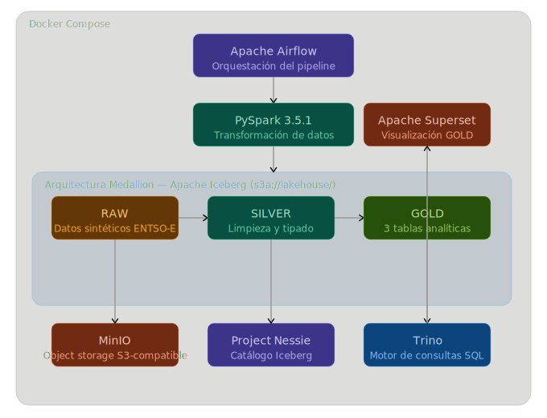
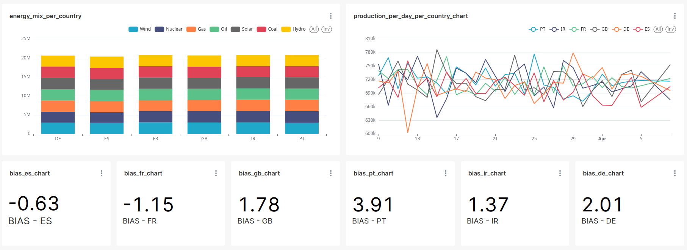

# entsoe-pipeline

Pipeline lakehouse sobre datos sintéticos de la Red Eléctrica Europea (ENTSO-E), implementando una arquitectura Medallion (RAW → SILVER → GOLD) con tecnologías del ecosistema moderno de datos.

Los datos son orquestados por Apache Airflow, procesados con PySpark y almacenados en tablas Apache Iceberg sobre MinIO, con Project Nessie como catálogo. Trino actúa como motor de consultas SQL distribuido, permitiendo a Apache Superset visualizar las capas GOLD sin mover los datos — desde la producción energética diaria por país hasta el mix energético por fuente y la precisión de los forecasts de carga.

El uso de datos sintéticos elimina la dependencia de la API de ENTSO-E, garantizando reproducibilidad, control del volumen de datos y portabilidad del proyecto. Cualquiera puede levantar el stack completo con `docker compose build && docker compose up`.

## Arquitectura



## Stack tecnológico

| Tecnología | Versión | Rol |
|---|---|---|
| Apache Airflow | 2.9.1 | Orquestación del pipeline |
| Apache PySpark | 3.5.1 | Procesamiento y transformación de datos |
| Apache Iceberg | 1.7.1 | Formato de tabla open table format |
| Project Nessie | 0.106.0 | Catálogo de metadatos Iceberg |
| MinIO | 1.40.1 | Object storage S3-compatible |
| Trino | 475 | Motor de consultas SQL distribuido |
| Apache Superset | 4.1.3 | Visualización y dashboards |

## Estructura del proyecto
```
entsoe-pipeline/
├── dags/
│   └── entsoe_pipeline.py        # DAG principal de Airflow
├── docker/
│   ├── init-db/                  # Scripts de inicialización de PostgreSQL
│   ├── superset/                 # Configuración de Apache Superset
│   └── trino/                    # Catálogo y configuración de Trino
├── docs/
│   ├── architecture.svg          # Diagrama de arquitectura del stack
│   └── superset_dashboard.png    # Captura del dashboard
├── spark/
│   ├── raw/                      # Generación e ingesta de datos RAW
│   ├── silver/                   # Transformación RAW → SILVER
│   ├── gold/                     # Agregaciones SILVER → GOLD
│   ├── spark_session.py          # Configuración centralizada de SparkSession
│   ├── utils.py                  # Funciones auxiliares compartidas
│   ├── drop_tables.py            # Utilidad para eliminar tablas Iceberg
│   └── test_spark_nessie.py      # Test de integración Spark-Nessie-MinIO
├── docker-compose.yml            # Definición de todos los servicios
└── Dockerfile                    # Imagen personalizada Airflow + PySpark
```

## Cómo levantar el entorno

### Requisitos previos
- Docker 20.x o superior (incluye Docker Compose)

### Instalación

1. Clona el repositorio:
```bash
   git clone https://github.com/tuusuario/entsoe-pipeline.git
   cd entsoe-pipeline
```

2. Crea el fichero de variables de entorno:
```bash
   cp .env.example .env
```

3. Construye y arranca los servicios:
```bash
   docker compose build && docker compose up -d
```

### Acceso a los servicios

| Servicio | URL | Credenciales |
|---|---|---|
| Airflow | http://localhost:8080 | Ver `.env` |
| MinIO | http://localhost:9001 | Ver `.env` |
| Superset | http://localhost:8088 | Ver `.env` |
| Nessie | http://localhost:19120 | — |
| Trino | http://localhost:8081 | — |

## Tablas GOLD

### `production_per_day_per_country`
Producción energética total diaria por país, agregada sobre todas las fuentes de generación.

| Columna | Descripción |
|---|---|
| `date` | Fecha de la agregación |
| `country_code` | Código del país (ES, FR, DE, PT, IT, NL) |
| `total_actual_mw` | Producción total en MW |
| `max_actual_mw` | Pico máximo de producción en MW |
| `min_actual_mw` | Pico mínimo de producción en MW |

### `forecast_accuracy`
Métricas de precisión entre el forecast de carga y la producción real, por país.

| Columna | Descripción |
|---|---|
| `date` | Fecha de la agregación |
| `country_code` | Código del país |
| `total_actual_load_mw` | Carga real total en MW |
| `total_forecast_load_mw` | Carga prevista total en MW |
| `mae` | Error absoluto medio (MW) |
| `mape` | Error porcentual absoluto medio |
| `bias` | Sesgo sistemático del forecast |

### `energy_mix_per_country`
Desglose del mix energético por país y tipo de fuente, con el peso relativo de cada una sobre el total.

| Columna | Descripción |
|---|---|
| `date` | Fecha de la agregación |
| `country_code` | Código del país |
| `production_type` | Tipo de fuente (solar, wind, nuclear, etc.) |
| `country_total_mw` | Producción total del país en MW |
| `total_per_type_mw` | Producción de esa fuente en MW |
| `pct_of_total` | Porcentaje sobre la producción total del país |

## Visualización

Dashboard interactivo construido en Apache Superset sobre las tablas GOLD, 
consultadas en tiempo real a través de Trino.




